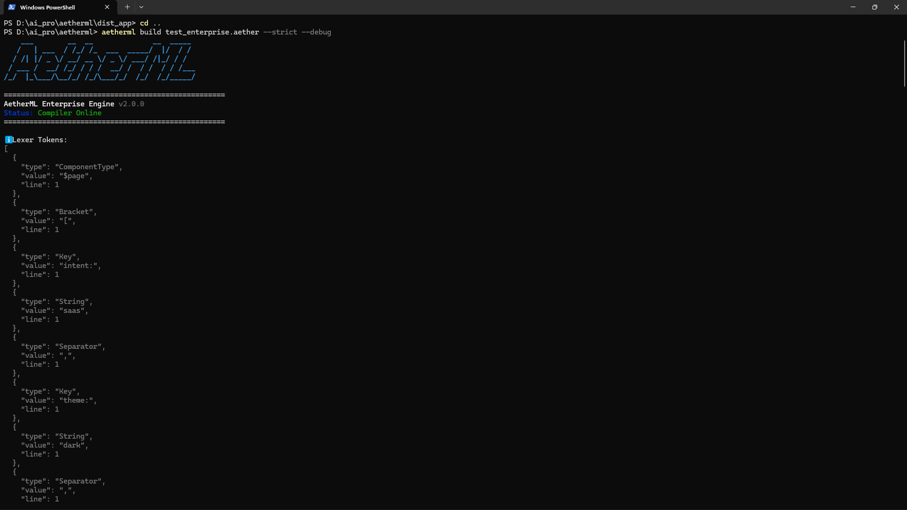

# 🌌 AetherML Enterprise Compiler




**AetherML** is an open-source, AI-Native DSL (Domain Specific Language) compiler. It compresses complex Next.js React code down to an extremely dense string, allowing AI models (like Gemini, Claude, and OpenAI) to generate full-stack, animated web applications at a fraction of the token cost.

Based on our [OpenAI BPE Token Benchmark](./benchmarks/token-ratio.js), AetherML achieves a token compression ratio ranging from **3.7x (simple landing pages)** up to **23.0x (complex data dashboards)** depending on page complexity.

Instead of paying an LLM to generate 450 tokens of React boilerplate, you pay it to generate 18 tokens of AetherML. The local AetherML compiler then natively expands it into a production-grade **Next.js App Router** architecture on your machine.

---

## ⚡ Quick Start

### 1. Install Globally
Install the compiler globally via NPM to use it anywhere on your system:
```bash
npm install -g aetherml
```

### 2. Configure Your AI Provider
Initialize the interactive wizard to securely connect your AI API keys (supports Gemini, Claude, OpenAI, and NVIDIA NIM).
```bash
aetherml init
```
*(Your keys are strictly stored in local `.env` files and never leave your machine).*

### 3. Generate an App via AI
Use natural language to prompt the AI. It will generate a highly compressed `temp.aether` file:
```bash
aetherml generate "Create a dark mode SaaS landing page with GSAP animations and a Razorpay checkout"
```

### 4. 1-Click Startup
Compile the AetherML file, automatically install NPM dependencies, and launch a Next.js `localhost:3000` dev server in a single step:
```bash
aetherml dev temp.aether
```

> [!WARNING]
> The `dist_app` directory is ephemeral. Running `dev` or `build` again will **overwrite your manual changes**. If you want to hand-tweak the generated Next.js code, you MUST run `aetherml eject` to safely detach your codebase.

---

## 🛡️ Enterprise Architecture & Guardrails

AetherML is not just a code generator; it is a defensive compliance engine designed for production.

*   **SEO Guardrails (`--strict`)**: Statically analyzes the AST (Abstract Syntax Tree) before compilation to protect your Google Search rankings.
    *   **Fatal Errors (Build Fails)**: Missing `<h1>` or intent meta, page `title` > 60 chars, meta `desc` > 165 chars, or skipping a heading hierarchy going deeper within a section (e.g., jumping from `h2` to `h4`).
    *   **Non-Fatal Warnings (Console Only)**: Missing meta `desc`, page `title` between 50-60 chars, or meta `desc` < 120 or 160-165 chars.
*   **The "Debugging Nightmare" Solved**: Source maps are automatically injected into the generated React components (`{/* AetherML Line 3: Generated from $sec:hero */}`), making it trivial to trace UI bugs back to the exact line in your DSL.
*   **Zero Vendor Lock-In (`eject`)**: Run `aetherml eject file.aether` to instantly detach from the compiler. It extracts a pure, unopinionated Next.js codebase to an `extracted_app` folder, giving you 100% code ownership.

---

## 📖 The DSL Syntax Guide

AetherML syntax is designed for maximum token compression.

### The Page Wrapper
Everything must be wrapped in a `$page` tag:
```aetherml
$page[intent:"saas", theme:"dark",
  // Components go here
]
```

### Core Components
*   **Hero Section**: `$sec:hero[h1:"Build Faster", subtitle:"AI Compiler"]`
*   **Pricing Section**: `$sec:pricing[tiers:"3", highlight:"pro"]`
*   **Buttons**: `$btn[label:"Buy Now"]`

### Integrations & Actions
AetherML bridges third-party SDKs using single tags. The compiler automatically scaffolds the required client/server React architecture.
*   **Supabase Auth**: `action:"$auth:supabase"`
*   **Razorpay**: `action:"$pay:razorpay[amount:'999']"`

### Animations
Wrap components in GSAP blocks to automatically generate `useGSAP` animation wrappers:
```aetherml
$anim:gsap[trigger:"load", effect:"fadeUp", 
  $sec:hero[h1:"Animated Hero!"]
]
```

---

## 💻 CLI Command Reference

| Command | Description |
| :--- | :--- |
| `aetherml init` | Launches the interactive AI configuration wizard. |
| `aetherml generate <prompt>`| Prompts the AI to generate a `.aether` file. |
| `aetherml dev <file>` | Compiles the DSL, installs dependencies, and runs `next dev`. |
| `aetherml build <file>` | Standard compilation to `dist_app` without starting a server. |
| `aetherml eject <file>` | Extracts pure React code to `extracted_app` and removes compiler links. |

**Flags:**
*   `--strict`: Fails the build if SEO requirements are unmet.
*   `--debug`: Outputs the full AST and Lexer token trace to the terminal.

---

## 🧠 The Pipeline

AetherML uses a 6-stage transformation pipeline:

1. **Lexer:** Graceful tokenization with automatic syntax repair.
2. **Parser:** Recursive descent builder with AST prototype-pollution shielding.
3. **Transformer:** Maps DSL to React/JSX Server Components.
4. **SEO Engine:** Injects valid JSON-LD and semantic tags based on page intent.
5. **Plugin Bridge:** Decouples external library logic from the core compiler.
6. **Generator:** Scaffolds a full-stack Next.js project with Tailwind CSS.

---

## 🔌 Extensibility

AetherML uses a decoupled plugin architecture. If your stack isn't listed, you can build a new integration in minutes by dropping a template file into `src/plugins/integrations/`.

We welcome community contributions! See our [CONTRIBUTING.md](./CONTRIBUTING.md) guide to add your favorite services.

---

## 🤝 Contributing
Please read [CONTRIBUTING.md](./CONTRIBUTING.md) for details on our code of conduct, and the process for submitting pull requests to the compiler engine.

## 📜 License
MIT. Built for the era of Autonomous Development.
AetherML is the "Engine" underneath your next SaaS project. Code less, ship more.
